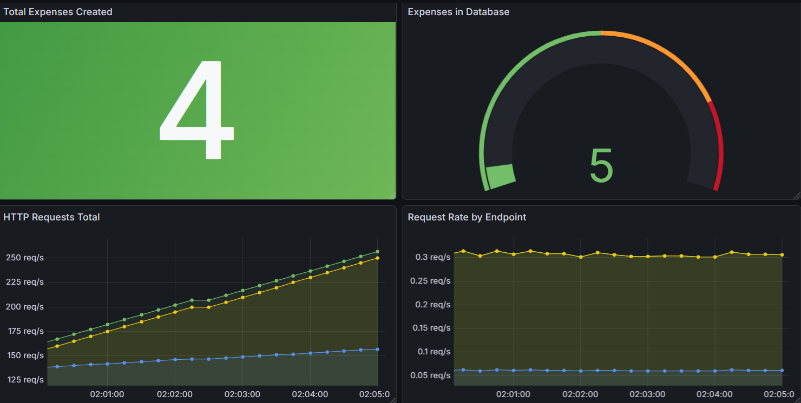

# 💸 SRE Expense Tracker

> A production-ready expense tracking REST API built to demonstrate **Site Reliability Engineering** and **DevOps** principles — not just a CRUD app.

[](https://github.com/Iriome-Santana/expense-tracker-sre/actions/workflows/ci.yml)


[](https://hub.docker.com/r/iriome2512/expense-tracker)

---

## 📖 Table of Contents

- [What is this?](#-what-is-this)
- [Architecture](#-architecture)
- [Project Structure](#-project-structure)
- [SRE Principles in Practice](#-sre-principles-in-practice)
- [Tech Stack](#-tech-stack)
- [Quick Start](#-quick-start)
- [API Reference](#-api-reference)
- [Environment Variables](#-environment-variables)
- [Running Tests](#-running-tests)
- [Architecture Decision Records](#-architecture-decision-records)
- [Roadmap](#-roadmap)
- [Author](#-author)

---

## 🧠 What is this?

This project started as a simple expense tracker and evolved into a **learning ground for SRE/DevOps engineering**. Every technical decision — from folder structure to error handling — was made deliberately and is documented here.

The goal is not just to build something that works, but to build something that is **observable, reliable, operable, and testable** — the four pillars of Site Reliability Engineering.

This is a self-taught project. If you're also learning SRE/DevOps, feel free to explore, fork, and open issues with feedback. I'd love to hear from other engineers on the same path.

---

## 🏗 Architecture

```
┌─────────────────────────────────────────────────────────────────┐
│                          INTERFACES                             │
│                                                                 │
│   ┌─────────────────┐           ┌─────────────────────────┐    │
│   │   CLI (scripts) │           │   FastAPI REST API       │    │
│   │   cli.py        │           │   /expenses  /summary   │    │
│   └────────┬────────┘           └────────────┬────────────┘    │
│            │                                 │                  │
└────────────┼─────────────────────────────────┼──────────────────┘
             │                                 │
             └──────────────┬──────────────────┘
                            │
┌───────────────────────────▼──────────────────────────────────────┐
│                      BUSINESS LOGIC                              │
│                                                                  │
│   ┌──────────────────────────────────────────────────────────┐   │
│   │                   ExpenseService                         │   │
│   │   + @validate_expense decorator (fail fast principle)    │   │
│   │   add_expense()  show_expenses()  delete_expense()       │   │
│   │   summary()                                              │   │
│   └──────────────────────────────┬───────────────────────────┘   │
│                                  │                               │
└──────────────────────────────────┼───────────────────────────────┘
                                   │
┌──────────────────────────────────▼───────────────────────────────┐
│                      PERSISTENCE LAYER                           │
│                                                                  │
│   ┌──────────────────────────────────────────────────────────┐   │
│   │         SQLAlchemy ORM  ·  session.py                    │   │
│   │         get_db() → yields session → closes in finally    │   │
│   └──────────────────────────────┬───────────────────────────┘   │
│                                  │                               │
└──────────────────────────────────┼───────────────────────────────┘
                                   │
┌──────────────────────────────────▼───────────────────────────────┐
│                          DATABASE                                │
│                                                                  │
│                     PostgreSQL 15                                │
│              (Docker service · persistent volume)                │
│                                                                  │
└──────────────────────────────────────────────────────────────────┘

Cross-cutting concerns
├── Structured logging with unique run_id per session (core/logging.py)
├── Automated CSV backups on startup       (services/backup_service.py)
├── HTTP-aware custom exceptions           (core/errors.py)
└── Generic error handler — no tracebacks in production (main.py)
```

### Docker Compose topology

```
┌─────────────────────────────────────────┐
│            Docker Network               │
│                                         │
│  ┌───────────────┐  ┌────────────────┐  │
│  │   api         │  │   db           │  │
│  │   :8002→8000  │──│   postgres:15  │  │
│  │               │  │   :5432        │  │
│  └───────────────┘  └───────┬────────┘  │
│                             │           │
│                    postgres_data volume │
└─────────────────────────────────────────┘

api depends_on db (condition: service_healthy)
db healthcheck: pg_isready every 5s
```

---

## 📁 Project Structure

```
expense-tracker/
├── src/
│   └── expense_tracker/           # Main package (src-layout)
│       ├── main.py                # FastAPI app · lifespan · error handlers
│       ├── models/
│       │   └── expense.py         # SQLAlchemy ORM model (Expense table)
│       ├── schemas/
│       │   └── expense.py         # Pydantic I/O schemas
│       ├── services/
│       │   ├── expense_service.py # Business logic + @validate_expense
│       │   └── backup_service.py  # CSV export with timestamp
│       ├── api/
│       │   └── routes/
│       │       └── expenses.py    # HTTP endpoints (GET/POST/DELETE)
│       ├── db/
│       │   └── session.py         # Engine · SessionLocal · get_db()
│       └── core/
│           ├── errors.py          # HTTP-aware custom exceptions
│           └── logging.py         # run_id filter · log retention
├── scripts/
│   └── cli.py                     # Interactive CLI (uses same service layer)
├── tests/
│   ├── conftest.py                # pytest fixtures (mock db + service)
│   └── test_expenses.py           # 11 unit tests — no real DB needed
├── deploy/
│   ├── Dockerfile                 # python:3.12-slim · pip install .
│   └── docker-compose.yml         # api + db · healthcheck · volume
├── .github/
│   └── workflows/
│       └── ci.yml                 # CI: checkout → python 3.12 → test
├── pyproject.toml                 # Dependencies · pytest config · build
├── .env.example                   # Environment variable template
└── .gitignore
```

---

## 🔍 SRE Principles in Practice

### 1. Observability

Every CLI session generates a unique `run_id` that is injected into every log line:

```
2026-03-18 14:30:22 - INFO  - Expense added successfully! - a3f9b2c1
2026-03-18 14:30:25 - INFO  - User viewed expenses        - a3f9b2c1
2026-03-18 14:31:01 - INFO  - User exited                 - a3f9b2c1
```

This means you can `grep a3f9b2c1 app.log` and reconstruct exactly what happened in one session — a core observability pattern used in distributed systems with trace IDs.

Log retention is also automated: logs older than `LOG_RETENTION_DAYS` are deleted on startup.

### 2. Reliability — Fail Fast

Input validation happens at the decorator level, before touching the database:

```python
@validate_expense
def add_expense(self, db, date, description, amount):
    # data is guaranteed valid here
```

The `@validate_expense` decorator catches invalid dates, empty fields, and negative amounts early, returning a clean HTTP 400 to the client instead of propagating errors down to the database layer.

Custom exceptions carry their own HTTP status codes:

```python
class NegativeAmountError(AppError):
    def __init__(self):
        super().__init__(status_code=400, detail="Amount must be greater than 0")

class ExpenseNotFoundError(AppError):
    def __init__(self, expense_id: int):
        super().__init__(status_code=404, detail=f"Expense with id {expense_id} not found")
```

### 3. Reliability — Automated Backups

On every CLI startup, all expenses are exported to a timestamped CSV:

```
backups/
├── expenses_backup_20260318_143022.csv
├── expenses_backup_20260317_091500.csv
└── expenses_backup_20260316_183045.csv
```

### 4. Operability

- All configuration via environment variables — no hardcoded values
- One-command deployment with Docker Compose
- `service_healthy` condition on `depends_on` — the API never starts before PostgreSQL is ready
- Generic error handler in production — no tracebacks exposed to clients
- Interactive API docs at `/docs` — no external tooling needed to explore the API

### 5. Testability

- 11 unit tests, all passing
- Database is fully mocked with `MagicMock` — tests run in ~0.02s with no PostgreSQL instance
- CI pipeline runs the full suite on every push and pull request to `main`
- `pytest-cov` for coverage reporting

---


## 📊 Monitoring Dashboards

The application exposes a `/metrics` endpoint that Prometheus scrapes every 15 seconds. Grafana visualizes the data in real time.



**Dashboards included:**
- **HTTP Requests Total** — accumulated request count per endpoint (`sum by (handler)`)
- **Request Rate by Endpoint** — real-time requests/sec per endpoint (`sum by (handler) (rate(...))`)
- **Total Expenses Created** — stat panel showing the running counter
- **Expenses in Database** — gauge with color thresholds (green → orange at 50 → red at 80)


## 🛠 Tech Stack

| Component | Technology | Why |
|-----------|-----------|-----|
| API framework | FastAPI 0.129 | Automatic OpenAPI docs, async-ready, Pydantic v2 |
| ORM | SQLAlchemy 2.0 | Clean separation between models and queries |
| Validation | Pydantic v2 | Type-safe request/response schemas |
| Database | PostgreSQL 15 | Production-grade, concurrent, typed |
| Testing | pytest + pytest-cov | Fast, fixture-based, coverage reporting |
| Containerization | Docker Compose | Two-service orchestration (api + db) |
| CI | GitHub Actions | Runs on every push/PR to main |
| Package mgmt | pyproject.toml | Modern Python standard (PEP 517/518) |

---

## 🚀 Quick Start

### Option 1 — Docker (recommended)

```bash
git clone https://github.com/Iriome-Santana/expense-tracker-sre.git
cd expense-tracker-sre

Or pull the pre-built image directly from Docker Hub:
```bash
docker pull iriome2512/expense-tracker
```
# Copy and configure environment variables
cp .env.example .env
nano .env  # Set your values (see Environment Variables section)

# Start both services
docker compose --env-file .env -f deploy/docker-compose.yml up --build
```

API available at **http://localhost:8002**  
Interactive docs at **http://localhost:8002/docs**

### Option 2 — Local

**Prerequisites:** Python 3.12+, PostgreSQL running locally.

```bash
git clone https://github.com/Iriome-Santana/expense-tracker-sre.git
cd expense-tracker-sre

# Install package + dev dependencies
pip install -e ".[dev]"

# Set environment variables
export DB_HOST=localhost
export DB_NAME=expense_tracker
export DB_USER=expense_user
export DB_PASSWORD=expense_pass

# Start the API
uvicorn expense_tracker.main:app --reload
```

API available at **http://localhost:8000**

### Option 3 — CLI

```bash
pip install -e ".[dev]"
python scripts/cli.py
```

> The CLI requires a running PostgreSQL instance (Docker or local).

---

## 📡 API Reference

| Method | Endpoint | Description | Success | Error |
|--------|----------|-------------|---------|-------|
| `GET` | `/` | Health check | 200 | — |
| `GET` | `/expenses/summary` | Total amount | 200 | — |
| `GET` | `/expenses/` | List all expenses | 200 | — |
| `POST` | `/expenses/` | Create expense | 201 | 400 |
| `DELETE` | `/expenses/{id}` | Delete by ID | 200 | 404 |

### Create expense

```bash
curl -X POST http://localhost:8002/expenses/ \
  -H "Content-Type: application/json" \
  -d '{"date": "2026-03-18", "description": "Coffee", "amount": 3.50}'

# 201 Created
{"message": "Expense added successfully!"}
```

### Validation error

```bash
curl -X POST http://localhost:8002/expenses/ \
  -H "Content-Type: application/json" \
  -d '{"date": "2026-03-18", "description": "Coffee", "amount": -5}'

# 400 Bad Request
{"detail": "Amount must be greater than 0"}
```

### Not found

```bash
curl -X DELETE http://localhost:8002/expenses/999

# 404 Not Found
{"detail": "Expense with id 999 not found"}
```

---

## ⚙️ Environment Variables

| Variable | Default | Description |
|----------|---------|-------------|
| `DB_HOST` | `localhost` | PostgreSQL host (`db` inside Docker) |
| `DB_PORT` | `5432` | PostgreSQL port |
| `DB_NAME` | `expense_tracker` | Database name |
| `DB_USER` | `expense_user` | Database user |
| `DB_PASSWORD` | `expense_pass` | Database password |
| `POSTGRES_USER` | — | Used by the PostgreSQL Docker image |
| `POSTGRES_PASSWORD` | — | Used by the PostgreSQL Docker image |
| `POSTGRES_DB` | — | Used by the PostgreSQL Docker image |
| `LOG_FILE` | `app.log` | Log file path |
| `LOG_RETENTION_DAYS` | `7` | Days before log file is deleted |
| `BACKUPS_DIR` | `backups` | Directory for CSV backups |

> ⚠️ Never commit your `.env` file. It is listed in `.gitignore` by default.

---

## 🧪 Running Tests

```bash
# Run all tests
pytest

# Run with coverage report
pytest --cov=expense_tracker --cov-report=term-missing

# Run without installing the package
PYTHONPATH=src python -m pytest tests/ -v
```

```
collected 11 items

tests/test_expenses.py::test_add_expense                 PASSED
tests/test_expenses.py::test_add_expense_amount_negative PASSED
tests/test_expenses.py::test_add_expense_amount_zero     PASSED
tests/test_expenses.py::test_add_expense_empty_fields    PASSED
tests/test_expenses.py::test_add_expense_invalid_date    PASSED
tests/test_expenses.py::test_show_expenses               PASSED
tests/test_expenses.py::test_show_expenses_empty         PASSED
tests/test_expenses.py::test_delete_expense              PASSED
tests/test_expenses.py::test_delete_expense_not_found    PASSED
tests/test_expenses.py::test_summary                     PASSED
tests/test_expenses.py::test_summary_empty               PASSED

11 passed in 0.02s
```

Tests use `MagicMock` for the database session — **no PostgreSQL instance required**.

---

## 📐 Architecture Decision Records

### Why src-layout instead of flat structure?

The original version had all files in the root directory. This works for scripts but breaks for installable packages: Python can accidentally import from the working directory instead of the installed package, causing subtle bugs that only appear in production. The `src/` layout forces Python to always import from the installed package, making the project behave identically locally and inside Docker.

### Why SQLAlchemy ORM instead of raw SQL?

Raw SQL is fine for simple queries, but as the schema grows, managing connections, transactions, and query composition becomes error-prone. SQLAlchemy provides a clean session lifecycle (`get_db()` with `finally: db.close()`), type-safe models, and `pool_pre_ping=True` which silently reconnects dropped database connections — important for long-running Docker services.

### Why pyproject.toml instead of requirements.txt?

`requirements.txt` only lists dependencies. `pyproject.toml` (PEP 517/518) defines the entire build system: dependencies, dev dependencies, pytest config, coverage config, and package discovery — all in one file. It also makes the project installable with `pip install -e .`, which is how both local development and the Dockerfile work consistently.

### Why mock the database in tests instead of a test database?

Tests should be **fast, isolated, and infrastructure-free**. A real PostgreSQL instance adds startup time, requires configuration in CI, and can produce flaky results if state leaks between tests. `MagicMock` lets us test all business logic in ~0.02s with no external dependencies — tests run identically on any machine and in GitHub Actions.

### Why HTTPException subclasses instead of separate exception handlers?

FastAPI already knows how to handle `HTTPException` — it reads `status_code` and `detail` and builds a clean JSON response automatically. By making custom exceptions subclass it, each error carries its own HTTP semantics (`400`, `404`) without needing to register a separate `@app.exception_handler` for every type. One `AppError` base class, and FastAPI handles the rest.

### Why `depends_on: condition: service_healthy` instead of just `depends_on`?

The basic `depends_on` only waits for the container process to start, not for PostgreSQL to be ready to accept connections. PostgreSQL takes 1–3 seconds to initialize after the container starts. Without a healthcheck, the API starts, tries to connect, fails, and crashes. The `pg_isready` healthcheck polls every 5 seconds and only marks the service healthy when PostgreSQL is genuinely accepting connections.

---

## 🗺 Roadmap

```
[✓] PostgreSQL persistence via SQLAlchemy ORM
[✓] REST API with FastAPI
[✓] src-layout package structure
[✓] HTTP-aware custom exceptions (400, 404)
[✓] Docker Compose with healthcheck
[✓] CI pipeline with GitHub Actions
[✓] Unit tests with mocks — 11/11 passing
[✓] Automated CSV backups with timestamp
[✓] Structured logging with run_id
[✓] Docker image published to Docker Hub (iriome2512/expense-tracker)
[✓] CI/CD pipeline — build and push on every push to main
[✓] Prometheus /metrics endpoint
[✓] Grafana dashboards (requests total · request rate · expenses counter · gauge)


[ ] JSON structured logging (replace plaintext format)
[ ] Alembic migrations (replace init_db())
[ ] Cloud deployment (Render / AWS ECS)
[ ] Integration tests with real PostgreSQL (testcontainers)
[ ] Rate limiting
[ ] Authentication (API keys or JWT)
```

---

## 👤 Author

Built by **Iriome Santana** as part of a self-taught journey into Site Reliability Engineering and DevOps.

This project is intentionally over-engineered for a simple expense tracker — that's the point. Every layer exists to demonstrate a real engineering principle, not because the problem demands it.

[](https://www.linkedin.com/in/iriome-santana-socorro)

---

> 💬 **Feedback welcome.** If you're also learning SRE/DevOps and want to discuss architecture decisions, open an issue or reach out on LinkedIn. I'm always happy to learn from other engineers on the same path.